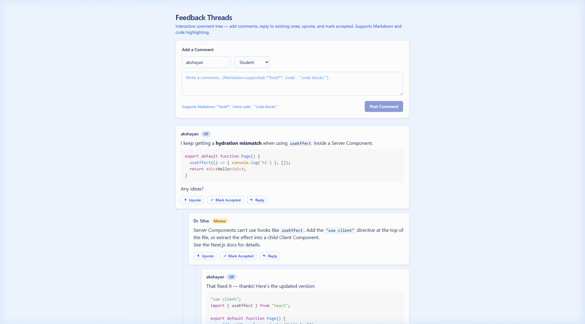
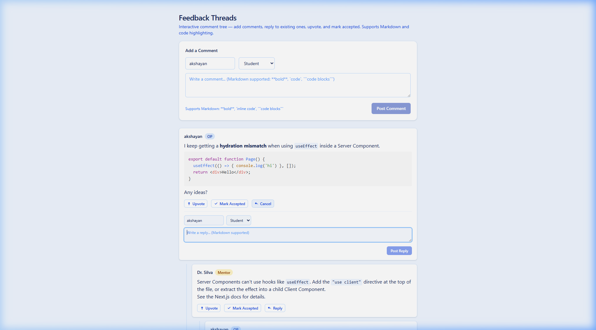
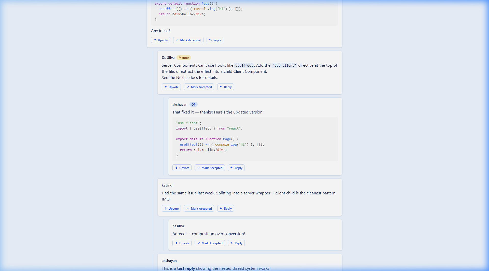
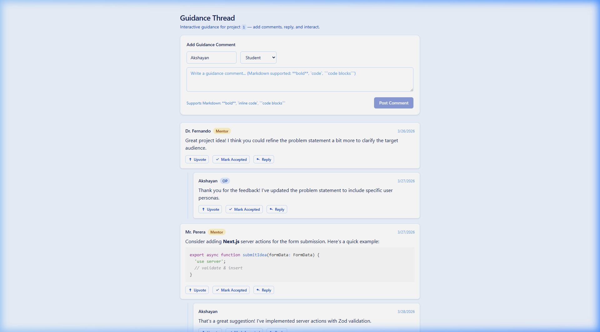
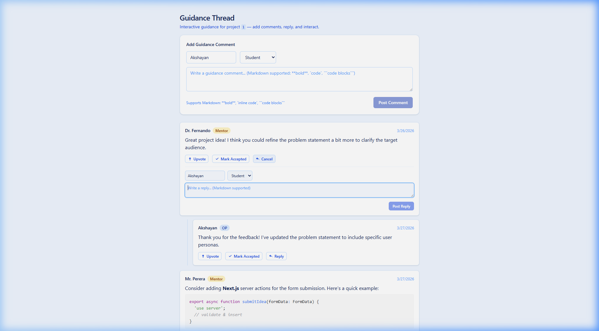

# Progress 1 — UI and Business Rules Document

**Module:** IT3040 – ITPM | Semester 1  
**Programme:** BSc (Hons) in Information Technology — Year 3  
**Date:** March 28, 2026

---

## Student Details

| Field | Value |
|---|---|
| **Student Name** | Akshayan |
| **Registration Number** | *(fill in your SLIIT reg. no.)* |
| **Responsible Component(s)** | Idea & Guidance Module (Member 2) |
| **Description** | A web module that lets students submit project ideas with form validation, engage in interactive recursive threaded feedback with Markdown/code support, and view guidance threads per project — all with live commenting, replying, upvote and accept interactions. |

---

## Component Summary

| # | UI Screen | Route | Screenshot |
|---|---|---|---|
| UI 1 | Project Idea Form (Empty) | `/posts/new` | `screenshots/01-post-form-empty.png` |
| UI 2 | Form Validation Errors | `/posts/new` (invalid submit) | `screenshots/02-validation-errors.png` |
| UI 3 | Title Min-Length Error | `/posts/new` (short title) | `screenshots/03-title-min-length-error.png` |
| UI 4 | Form Filled with Valid Data | `/posts/new` (completed) | `screenshots/04-form-filled.png` |
| UI 5 | Successful Submission | `/posts/new` (submitted) | `screenshots/05-form-success.png` |
| UI 6 | Feedback Thread (Static View) | `/feedback` | `screenshots/06-feedback-thread.png` |
| UI 7 | Feedback Upvote & Accept | `/feedback` (toggled) | `screenshots/07-feedback-upvote-accept.png` |
| UI 8 | Guidance Thread (Static View) | `/guidance/[projectId]` | `screenshots/08-guidance-thread.png` |
| UI 9 | Guidance Interactions | `/guidance/[projectId]` (toggled) | `screenshots/09-guidance-interactions.png` |
| UI 10 | Interactive Feedback Form | `/feedback` (interactive) | `screenshots/10-feedback-interactive-form.png` |
| UI 11 | Feedback Reply Form | `/feedback` (reply open) | `screenshots/11-feedback-reply-form.png` |
| UI 12 | Feedback Reply Posted | `/feedback` (reply nested) | `screenshots/12-feedback-reply-posted.png` |
| UI 13 | New Root Comment Posted | `/feedback` (new comment) | `screenshots/13-feedback-new-comment.png` |
| UI 14 | Interactive Guidance Thread | `/guidance/1` (interactive) | `screenshots/14-guidance-interactive.png` |
| UI 15 | Guidance Reply Form | `/guidance/1` (reply open) | `screenshots/15-guidance-reply-form.png` |

---

## UI 1 & 2: Project Idea Submission Form (`/posts/new`)

**Screenshots:** `01-post-form-empty.png`, `04-form-filled.png`, `05-form-success.png`


### A) Form Fields

| # | Field | Type | Description |
|---|---|---|---|
| F-1 | **Title** | Text input | Descriptive title for the project idea |
| F-2 | **Problem Statement** | Textarea | Multi-line description of the problem |
| F-3 | **Project Variant** | Select dropdown | One of: Research, Prototype, Capstone, Mini-project |
| F-4 | **URLs** | Dynamic URL list | Reference links (add/remove dynamically) |
| F-5 | **Tech Stacks** | Tag Picker (multi-select) | Technology tags: Next.js, React, TypeScript, Tailwind CSS, Supabase, PostgreSQL, Prisma, Node.js |

### B) Validation Rules (Zod Schema)

| # | Field | Rule | Error Message |
|---|---|---|---|
| VR-1 | **Title** | Required. Minimum 10 characters. Trimmed whitespace. | "Title is required" / "Title must be at least 10 characters" |
| VR-2 | **Problem Statement** | Required. Non-empty string. Trimmed. | "Problem statement is required" |
| VR-3 | **Project Variant** | Required. Must be one of the 4 allowed values. | "Please select a project variant" |
| VR-4 | **URLs** | Optional. Each entry must be valid URL format. | "Each URL must be valid (e.g. https://…)" |
| VR-5 | **Tech Stacks** | Optional. Values must be from predefined list. | — |
| VR-6 | **All fields** | Validation uses Zod `safeParse()`. Errors shown inline below each field in red. | — |

### C) Validation Error Screenshots


*Empty form submission → "Title is required", "Problem statement is required", "Please select a project variant"*


*Short title ("test") → "Title must be at least 10 characters"*

### D) Process / Workflow Rules

| # | Rule |
|---|---|
| WF-1 | User fills in form fields → clicks "Submit Idea" → Zod schema validates all fields → if valid, returns success response with submitted data. |
| WF-2 | On successful submission, a green success banner appears showing the submitted data in JSON format. |
| WF-3 | On validation failure, the form re-renders with inline red error messages. Entered data preserved. |
| WF-4 | The submit button shows "Submitting…" and is disabled while processing (`useFormStatus`), preventing double submissions. |

### E) Successful Submission


*Filled form with title, problem statement, Prototype variant, and 4 selected tech tags*


*Success banner: "Project idea submitted successfully!" with JSON output*

### F) Tag Picker Interaction Rules

| # | Rule |
|---|---|
| TP-1 | Tags displayed as pill-shaped buttons in a horizontal row. |
| TP-2 | Click toggles: unselected (white) → selected (blue filled). |
| TP-3 | Counter shows "N selected" in real-time. |
| TP-4 | Selected tags serialized as JSON in hidden input for form submission. |
| TP-5 | Tag state managed using `Set<string>` in `useState`. |

### G) URL List Interaction Rules

| # | Rule |
|---|---|
| UL-1 | Form starts with one empty URL input. |
| UL-2 | "+ Add another URL" adds inputs dynamically. |
| UL-3 | Each input (after first) has red "×" to remove. |
| UL-4 | Counter shows "N added" for non-empty URLs. |
| UL-5 | Non-empty URLs serialized as JSON in hidden input. |

---

## UI 3: Interactive Feedback Thread (`/feedback`)

**Screenshots:** `10-feedback-interactive-form.png`, `11-feedback-reply-form.png`, `12-feedback-reply-posted.png`, `13-feedback-new-comment.png`



*Interactive feedback page with "Add a Comment" form, name input, role selector, and Markdown-supported textarea*

### A) Comment Form Rules (New Root Comments)

| # | Rule |
|---|---|
| CF-1 | An "Add a Comment" form appears at the top of the thread with: name input, role selector (Student/Mentor/OP), and a Markdown-enabled textarea. |
| CF-2 | Clicking "Post Comment" adds the new comment as a root-level node in the thread tree. |
| CF-3 | The form validates: empty comments are rejected (submit button disabled when textarea is empty). |
| CF-4 | The comment counter ("Total comments: N · Tree roots: N") updates in real-time. |
| CF-5 | New comments support **Markdown** formatting: `**bold**`, `` `code` ``, ` ```code blocks``` `. |
| CF-6 | The role selector determines the badge: Student (no badge), Mentor (amber badge), OP (blue badge). |

### B) Reply Form Rules (Nested Comments)

| # | Rule |
|---|---|
| RF-1 | Each comment has a **"Reply"** button alongside Upvote and Mark Accepted. |
| RF-2 | Clicking "Reply" opens an inline reply form directly below the comment, with name, role, and textarea. |
| RF-3 | The Reply button text changes to **"Cancel"** when the form is open, allowing toggle. |
| RF-4 | Submitting a reply sets the new comment's `parent_id` to the target comment's `id`. |
| RF-5 | The reply immediately renders as a **nested child** with indentation and left border line. |
| RF-6 | After posting, the reply form closes automatically and the textarea is cleared. |



*Reply form shown inline below the OP comment — "Reply" button changed to "Cancel"*



*Newly posted reply renders nested under the parent with left border indentation*

### C) Display Rules

| # | Rule |
|---|---|
| DR-1 | Comments rendered as a **recursive tree**. Replies indented with left blue border. |
| DR-2 | Nesting depth is **unlimited**. |
| DR-3 | **Mentor** comments show amber "Mentor" badge. |
| DR-4 | **OP** comments show blue "OP" badge. |
| DR-5 | **Student** comments show no badge. |
| DR-6 | Comment body supports full **Markdown** with syntax-highlighted code blocks. |

### D) Upvote Toggle Rules

| # | Rule |
|---|---|
| UV-1 | "Upvote" button toggles to "Upvoted" (blue filled, `aria-pressed=true`). |
| UV-2 | Click again toggles back. Per-comment, independent, client-side (`useState`). |

### E) Accept Solution Toggle (OP Only)

| # | Rule |
|---|---|
| AS-1 | "Mark Accepted" button appears only when `isOP={true}`. |
| AS-2 | Toggles to "Accepted" (green filled). Independent of upvote. |


*"Upvoted" (blue) and "Accepted" (green) active simultaneously*

### F) Tree Building Algorithm

| # | Rule |
|---|---|
| TB-1 | `buildCommentTree()` uses a **two-pass O(n) algorithm** with a `Map`. |
| TB-2 | Pass 1: Index each comment. Pass 2: Link children to parents via `parent_id`. |
| TB-3 | Orphan comments (invalid `parent_id`) promoted to root level. |
| TB-4 | New comments added to the flat array → tree rebuilds → React re-renders. |

### G) State Management Rules

| # | Rule |
|---|---|
| SM-1 | All comment data stored in React `useState<Comment[]>` (client-side). |
| SM-2 | Adding a comment appends to the flat array with a unique generated `id`. |
| SM-3 | `buildCommentTree()` is called on every render to rebuild the tree from the latest flat array. |
| SM-4 | Upvote/accept states are per-component `useState` — independent and reset on page reload. |

---

## UI 4: Interactive Guidance Thread (`/guidance/[projectId]`)

**Screenshots:** `14-guidance-interactive.png`, `15-guidance-reply-form.png`



*Guidance thread with "Add Guidance Comment" form, mentor comments with dates, and code blocks*

### A) Display Rules

| # | Rule |
|---|---|
| DR-8 | Heading: "Guidance Thread" with `projectId` in `<code>` tag. |
| DR-9 | Dynamic route: `/guidance/[projectId]` accepts any project ID. |
| DR-10 | Comments show `created_at` date stamps on the right side. |
| DR-11 | Mentor badge (amber), OP badge (blue), code blocks with syntax highlighting. |

### B) Comment Form Rules

| # | Rule |
|---|---|
| GF-1 | "Add Guidance Comment" form at top: name input, role selector, Markdown textarea. |
| GF-2 | Posts new root comments with auto-generated `id`, `project_id`, and `created_at`. |
| GF-3 | Total comments counter updates in real-time. |

### C) Reply Form Rules

| # | Rule |
|---|---|
| GR-1 | Each comment has "Reply" button. Opens inline reply form below. |
| GR-2 | Replies nest under the parent automatically via `parent_id`. |
| GR-3 | Reply form includes name, role selector, and Markdown-supported textarea. |



*Inline reply form open on Dr. Fernando's mentor comment — "Reply" changed to "Cancel"*

### D) Data Fetch Rules

| # | Rule |
|---|---|
| DF-1 | Initial comments fetched server-side via `fetchCommentsByProjectId()`. |
| DF-2 | Empty state: "No guidance comments yet — be the first to reply!" |
| DF-3 | Same `buildCommentTree()` O(n) algorithm as feedback thread. |

---

## Technology Stack

| Technology | Purpose |
|---|---|
| Next.js 14 (App Router) | React framework with Server/Client Components |
| React 18 | UI component library with `useState`, `useCallback` |
| TypeScript 5 | Type-safe development |
| Tailwind CSS | Utility-first CSS styling |
| Zod | Schema-based form validation |
| react-markdown | Markdown rendering in comments |
| remark-gfm | GitHub-Flavored Markdown support |
| react-syntax-highlighter | Code block syntax highlighting (Prism) |

---

## Version Control

| Field | Value |
|---|---|
| **Repository** | `https://github.com/sneha-dhaya-IT/Ideabridge.git` |
| **Branch** | `member2-idea-guidance` |
| **Commits** | Meaningful commits tracking each feature addition |

---

## Project Structure

```
src/
├── app/
│   ├── layout.tsx                       — Root layout (Server Component)
│   ├── page.tsx                         — Home page
│   ├── globals.css                      — Global styles
│   ├── posts/new/page.tsx               — Project Idea Form page
│   ├── feedback/page.tsx                — Interactive Feedback Thread page
│   └── guidance/[projectId]/
│       ├── page.tsx                     — Guidance page (Server → Client)
│       └── InteractiveGuidanceClient.tsx — Client bridge component
├── components/
│   ├── post-form/
│   │   ├── PostForm.tsx                 — Form wrapper + action handler
│   │   ├── PostFormClient.tsx           — Interactive form UI (useFormState)
│   │   ├── TagPicker.tsx                — Multi-select tag picker
│   │   └── schema.ts                   — Zod validation schema
│   ├── feedback-thread/
│   │   ├── InteractiveFeedback.tsx      — State manager + comment form
│   │   ├── InteractiveCommentNode.tsx   — Recursive renderer + reply form
│   │   ├── FeedbackThread.tsx           — Server Component (static view)
│   │   ├── CommentNode.tsx              — Static comment renderer
│   │   ├── CommentNodeClient.tsx        — Client wrapper
│   │   └── types.ts                    — Types + buildCommentTree()
│   └── guidance-thread/
│       ├── InteractiveGuidance.tsx       — State manager + comment form
│       ├── InteractiveGuidanceNode.tsx   — Recursive renderer + reply form
│       ├── GuidanceThread.tsx            — Server Component (static view)
│       ├── GuidanceCommentNode.tsx       — Static comment renderer
│       └── data.ts                     — Types + fetchComments + buildTree
```
