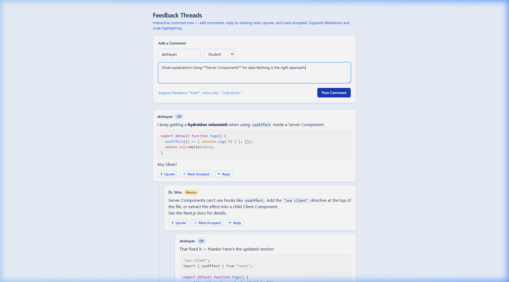
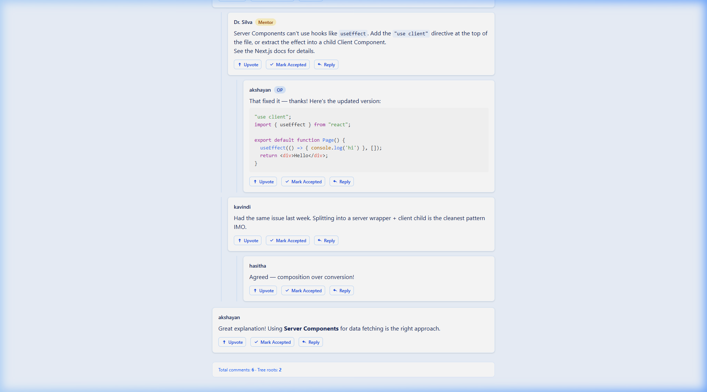
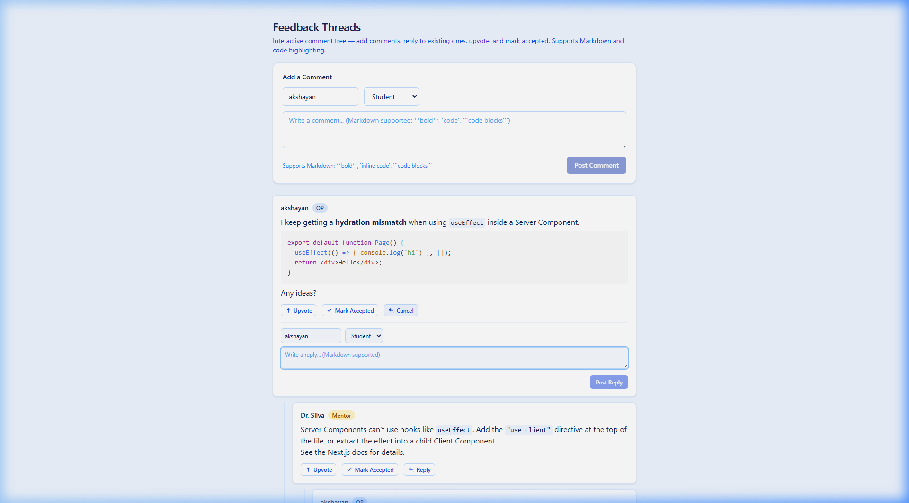
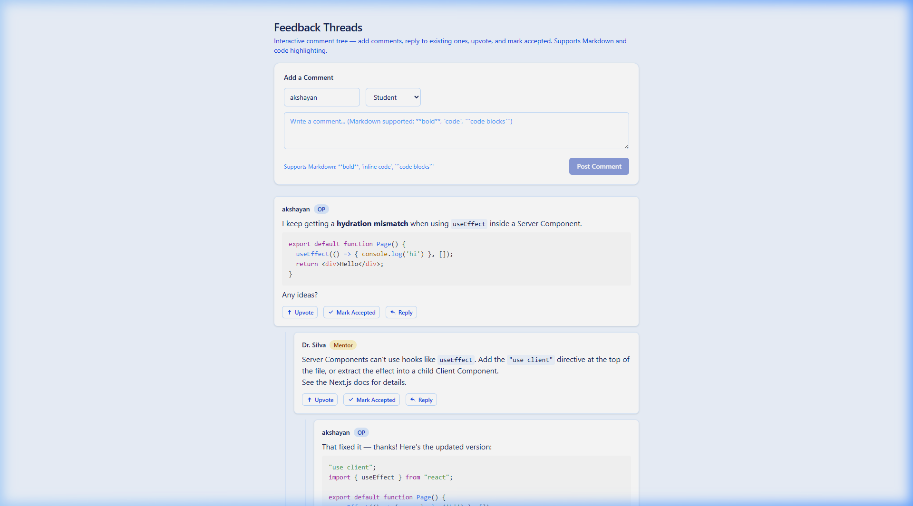
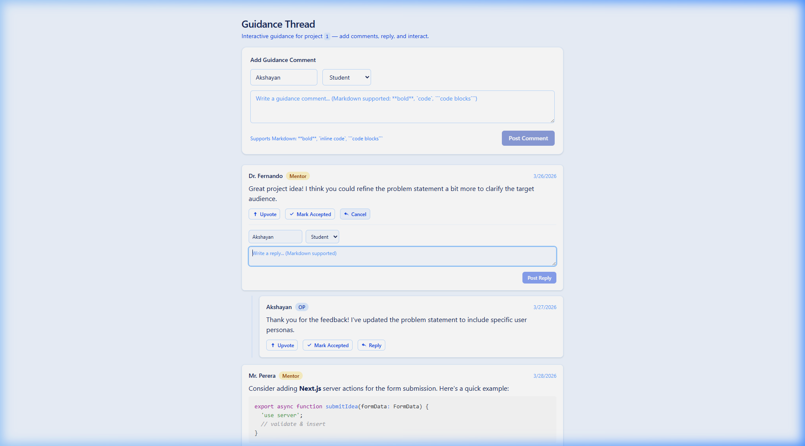

# Progress 1 — UI and Business Rules Document

**Module:** IT3040 – ITPM | Semester 1  
**Programme:** BSc (Hons) in Information Technology — Year 3  
**Date:** March 28, 2026

---

## Student Details

| Field | Value |
|---|---|
| **Student Name** | Akshayan |
| **Registration Number** | *(fill in your SLIIT reg. no.)* |
| **Responsible Component(s)** | Idea & Guidance Module (Member 2) |
| **Description** | A web module that lets students submit project ideas with form validation, receive recursive threaded feedback from mentors and peers with Markdown/code support, and view/post guidance comments per project with upvote, accept, and nested reply interactions. |

---

## Component Summary

| # | UI Screen | Route | Screenshot |
|---|---|---|---|
| UI 1 | Project Idea Form (Empty) | `/posts/new` | `screenshots/01-post-form-empty.png` |
| UI 2 | Form Validation Errors | `/posts/new` (invalid submit) | `screenshots/02-validation-errors.png` |
| UI 3 | Title Minimum-Length Validation | `/posts/new` (short title) | `screenshots/03-title-min-length-error.png` |
| UI 4 | Form Filled with Valid Data | `/posts/new` (completed) | `screenshots/04-form-filled.png` |
| UI 5 | Successful Submission | `/posts/new` (submitted) | `screenshots/05-form-success.png` |
| UI 6 | Feedback Thread (Read + Interact) | `/feedback` | `screenshots/10-feedback-interactive-form.png` |
| UI 7 | Feedback — Typing a Comment | `/feedback` | `screenshots/11-feedback-typed.png` |
| UI 8 | Feedback — Comment Posted | `/feedback` | `screenshots/12-feedback-posted.png` |
| UI 9 | Feedback — Inline Reply Form | `/feedback` | `screenshots/13-feedback-reply-form.png` |
| UI 10 | Feedback — Nested Reply Posted | `/feedback` | `screenshots/14-feedback-reply-posted.png` |
| UI 11 | Guidance Thread (Interactive) | `/guidance/[projectId]` | `screenshots/15-guidance-interactive.png` |
| UI 12 | Guidance — Inline Reply Form | `/guidance/[projectId]` | `screenshots/16-guidance-reply-form.png` |

---

## UI 1 & 2: Project Idea Submission Form (`/posts/new`)

**Screenshots:** `01-post-form-empty.png`, `04-form-filled.png`, `05-form-success.png`


### A) Form Fields

| # | Field | Type | Description |
|---|---|---|---|
| F-1 | **Title** | Text input | Descriptive title for the project idea |
| F-2 | **Problem Statement** | Textarea | Multi-line description of the problem |
| F-3 | **Project Variant** | Select dropdown | Research / Prototype / Capstone / Mini-project |
| F-4 | **URLs** | Dynamic URL list | Reference links (add/remove dynamically) |
| F-5 | **Tech Stacks** | Tag Picker (multi-select) | Next.js, React, TypeScript, Tailwind CSS, Supabase, PostgreSQL, Prisma, Node.js |

### B) Validation Rules (Zod Schema)

| # | Field | Rule | Error Message |
|---|---|---|---|
| VR-1 | **Title** | Required. Minimum 10 characters. Trimmed. | "Title is required" / "Title must be at least 10 characters" |
| VR-2 | **Problem Statement** | Required. Non-empty string. Trimmed. | "Problem statement is required" |
| VR-3 | **Project Variant** | Required. Must be one of 4 allowed values. | "Please select a project variant" |
| VR-4 | **URLs** | Optional. Each entry must be valid URL format. | "Each URL must be valid (e.g. https://…)" |
| VR-5 | **Tech Stacks** | Optional. Values must be from predefined list. | — |
| VR-6 | **All fields** | Validated via Zod `safeParse()`. Errors shown inline in red below each field. | — |

### C) Validation Error Screenshots


*Empty submit → "Title is required", "Problem statement is required", "Please select a project variant"*


*Short title ("test") → "Title must be at least 10 characters"*

### D) Workflow Rules

| # | Rule |
|---|---|
| WF-1 | User fills fields → clicks "Submit Idea" → Zod validates → if valid, returns success. |
| WF-2 | Success: green banner displays submitted data in JSON format. |
| WF-3 | Failure: form re-renders inline red errors. Entered data is preserved. |
| WF-4 | Submit button shows "Submitting…" and disables during processing (`useFormStatus`). |


### E) Tag Picker Rules

| # | Rule |
|---|---|
| TP-1 | Tags displayed as pill-shaped buttons. Click toggles selected (blue) / unselected (white). |
| TP-2 | Counter shows "N selected" in real-time. |
| TP-3 | Selected tags serialized as JSON in hidden input for form submission. |
| TP-4 | Tag state managed using `Set<string>` in `useState`. |

### F) URL List Rules

| # | Rule |
|---|---|
| UL-1 | Form starts with one empty URL input. |
| UL-2 | "+ Add another URL" adds inputs dynamically. |
| UL-3 | Each input (after first) has a red "×" remove button. |
| UL-4 | Counter shows "N added" for non-empty URLs. |

---

## UI 3: Feedback Thread — Interactive Comment Tree (`/feedback`)

**Screenshots:** `10-feedback-interactive-form.png` through `14-feedback-reply-posted.png`


### A) Display Rules

| # | Rule |
|---|---|
| DR-1 | Comments rendered as recursive tree. Replies indented with left blue border (`ml-6 pl-4`). |
| DR-2 | Nesting depth is unlimited. |
| DR-3 | **Mentor** comments show amber "Mentor" badge. |
| DR-4 | **OP** comments show blue "OP" badge. |
| DR-5 | **Student** comments show no badge. |
| DR-6 | Comment body supports Markdown: bold, links, inline code, fenced code blocks with syntax highlighting. |

### B) New Comment Form Rules

| # | Rule |
|---|---|
| CF-1 | An "Add a Comment" form is displayed at the top of the page above the thread. |
| CF-2 | User sets their **name** (text input) and **role** (Student / Mentor / OP) before posting. |
| CF-3 | Textarea supports Markdown. Placeholder text demonstrates supported syntax. |
| CF-4 | "Post Comment" button is disabled while the textarea is empty. |
| CF-5 | On submit: comment added to the root of the tree. Textarea clears. |
| CF-6 | Counter at the bottom shows total comments and root count, updating in real-time. |




### C) Reply (Nested Comment) Rules

| # | Rule |
|---|---|
| RP-1 | Every comment has a "Reply" button (arrow icon) next to Upvote and Accept. |
| RP-2 | Clicking "Reply" expands an **inline reply form** directly below the comment body. |
| RP-3 | The reply form contains the same name + role selector and a textarea. |
| RP-4 | Clicking "Reply" again (showing "Cancel") collapses the form without posting. |
| RP-5 | "Post Reply" is disabled while the reply textarea is empty. |
| RP-6 | On submit: reply is added as a **child** of that comment at `depth + 1` nesting. |
| RP-7 | Reply form clears and collapses after a successful post. Form auto-focuses the textarea. |




### D) Upvote & Accept Toggle Rules

| # | Rule |
|---|---|
| UV-1 | Each comment has an "Upvote" button. Toggles blue filled state on click. |
| UV-2 | "Mark Accepted" shown when `isOP={true}`. Toggles green filled state on click. |
| UV-3 | Both states are independent and can be active simultaneously. Client-side only (`useState`). |

### E) Tree State Management

| # | Rule |
|---|---|
| TM-1 | All comment state (seed + new) stored in a single `useState<Comment[]>` flat array. |
| TM-2 | `buildCommentTree()` is called on every render to rebuild the tree from the flat array. |
| TM-3 | New comments are appended to the flat array with a unique `id` (`Date.now() + random`). |
| TM-4 | Reply comments set `parent_id` to the target comment's `id`, nesting correctly via the tree builder. |
| TM-5 | State resets on page reload (no persistence — client-side only). |

---

## UI 4: Guidance Thread — Interactive (`/guidance/[projectId]`)

**Screenshots:** `15-guidance-interactive.png`, `16-guidance-reply-form.png`


### A) Display Rules

| # | Rule |
|---|---|
| DR-7 | Page heading "Guidance Thread" with `projectId` shown as `<code>` in the subtitle. |
| DR-8 | Dynamic route: `/guidance/[projectId]` accepts any project ID in the URL. |
| DR-9 | Each comment shows a `created_at` **date stamp** on the right side of the header. |
| DR-10 | Thread structure identical to Feedback — recursive nesting, role badges, Markdown/code. |

### B) Interactive Features (same rules as Feedback Thread)

| # | Rule |
|---|---|
| GI-1 | "Add Guidance Comment" form at page top — same name/role/textarea/Post button UI. |
| GI-2 | Reply button on every comment opens an inline form with name, role, textarea, "Post Reply". |
| GI-3 | Upvote and Mark Accepted behave identically to the Feedback Thread. |
| GI-4 | Comment count stats shown at the bottom (total + root count). |

### C) Data Rules

| # | Rule |
|---|---|
| DF-1 | Initial comments fetched server-side (`fetchCommentsByProjectId`) — async Server Component. |
| DF-2 | Fetched data passed as props to `InteractiveGuidanceClient` → `InteractiveGuidance` (Client Component). |
| DF-3 | New comments added client-side using the same `useState` + `buildCommentTree` pattern. |



---

## Updated Project Structure

```
src/
├── app/
│   ├── layout.tsx
│   ├── page.tsx
│   ├── globals.css
│   ├── posts/new/page.tsx
│   ├── feedback/page.tsx                       ← Now uses InteractiveFeedback
│   └── guidance/[projectId]/
│       ├── page.tsx                            ← Server Component (fetches data)
│       └── InteractiveGuidanceClient.tsx       ← [NEW] Client bridge wrapper
├── components/
│   ├── post-form/
│   │   ├── PostForm.tsx
│   │   ├── PostFormClient.tsx
│   │   ├── TagPicker.tsx
│   │   └── schema.ts
│   ├── feedback-thread/
│   │   ├── FeedbackThread.tsx
│   │   ├── CommentNode.tsx
│   │   ├── CommentNodeClient.tsx
│   │   ├── InteractiveFeedback.tsx             ← [NEW] Root comment form + state
│   │   ├── InteractiveCommentNode.tsx          ← [NEW] CommentNode + Reply button
│   │   └── types.ts
│   └── guidance-thread/
│       ├── GuidanceThread.tsx
│       ├── GuidanceCommentNode.tsx
│       ├── InteractiveGuidance.tsx             ← [NEW] Root comment form + state
│       ├── InteractiveGuidanceNode.tsx         ← [NEW] GuidanceNode + Reply button
│       └── data.ts
```

---

## Technology Stack

| Technology | Purpose |
|---|---|
| Next.js 14 (App Router) | React framework with Server/Client Components |
| React 18 | UI library + hooks (`useState`, `useCallback`, `useFormState`, `useFormStatus`) |
| TypeScript 5 | Type-safe development |
| Tailwind CSS | Utility-first CSS styling |
| Zod | Schema-based form validation |
| react-markdown | Markdown rendering in comments |
| remark-gfm | GitHub-Flavored Markdown support |
| react-syntax-highlighter | Code block syntax highlighting |

---

## Version Control

| Field | Value |
|---|---|
| **Repository** | `https://github.com/sneha-dhaya-IT/Ideabridge.git` |
| **Branch** | `member2-idea-guidance` |
