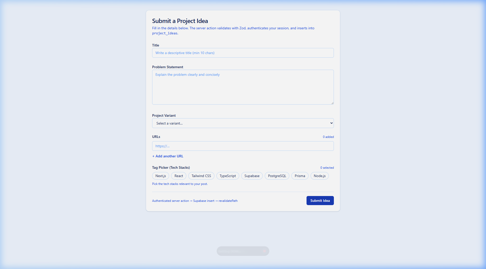
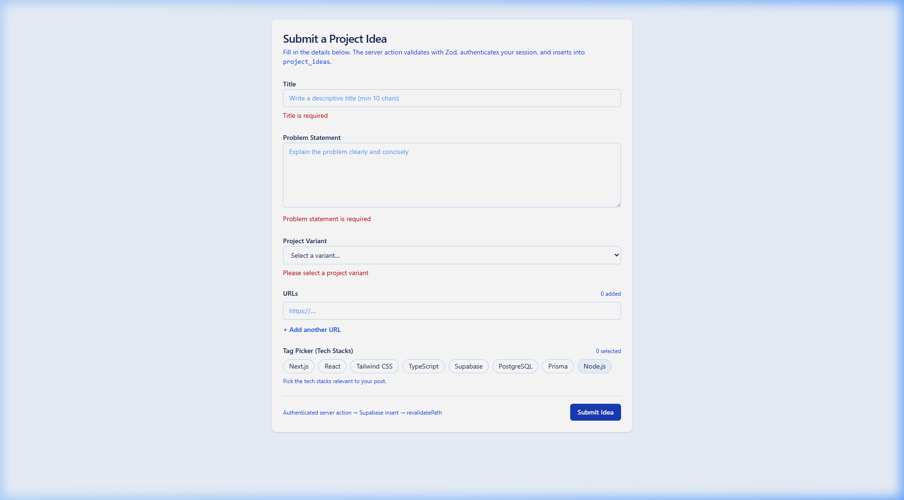
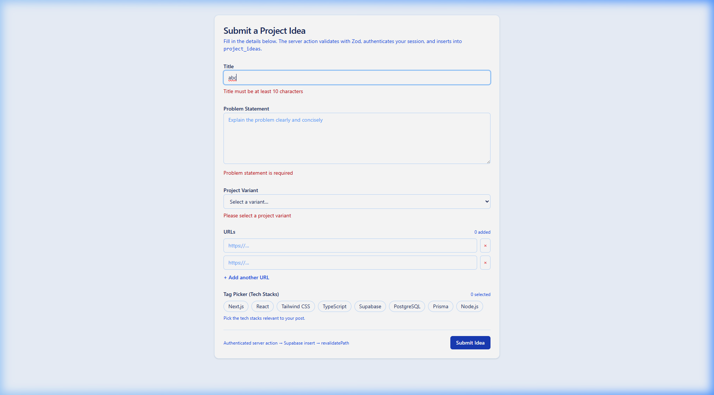
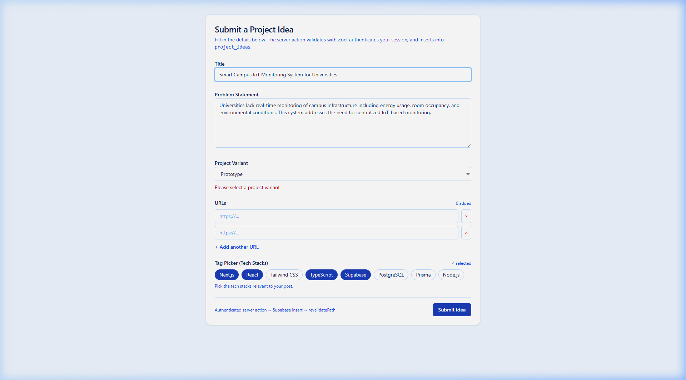
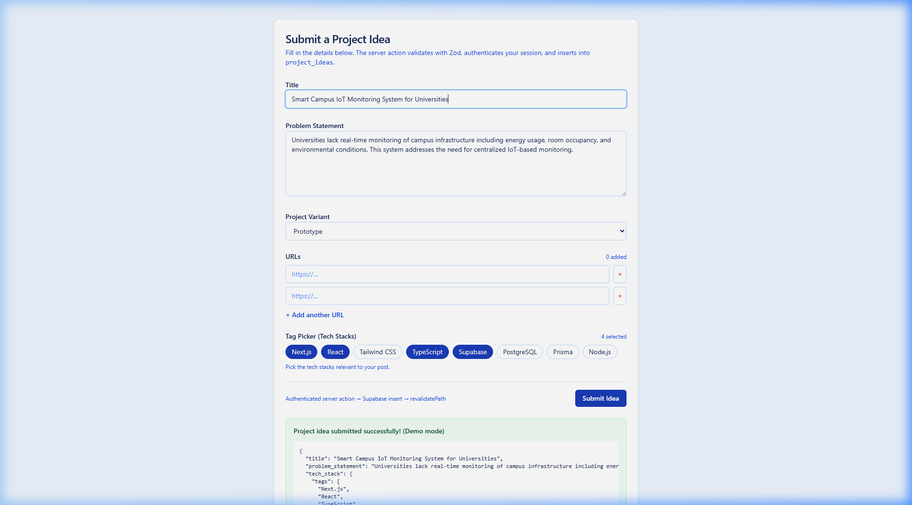
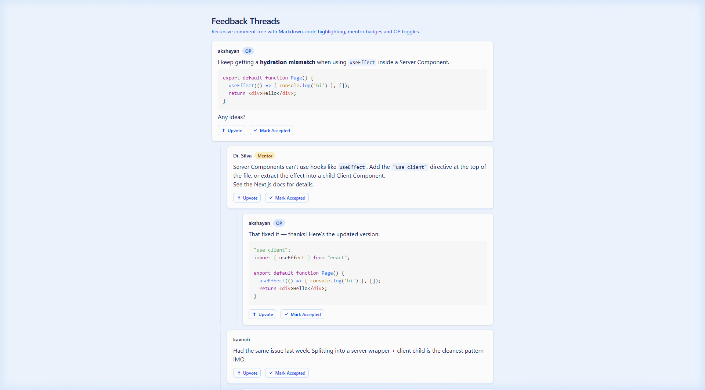
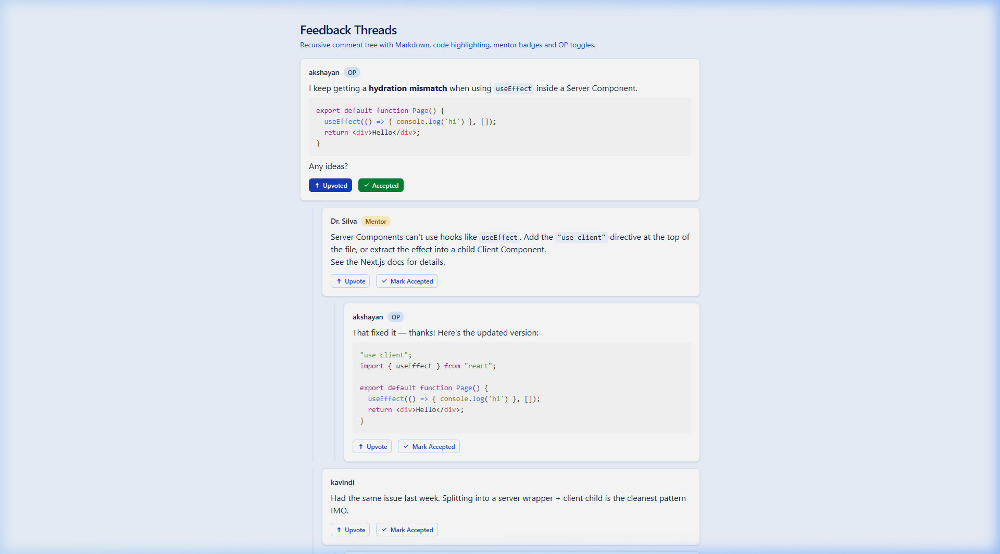
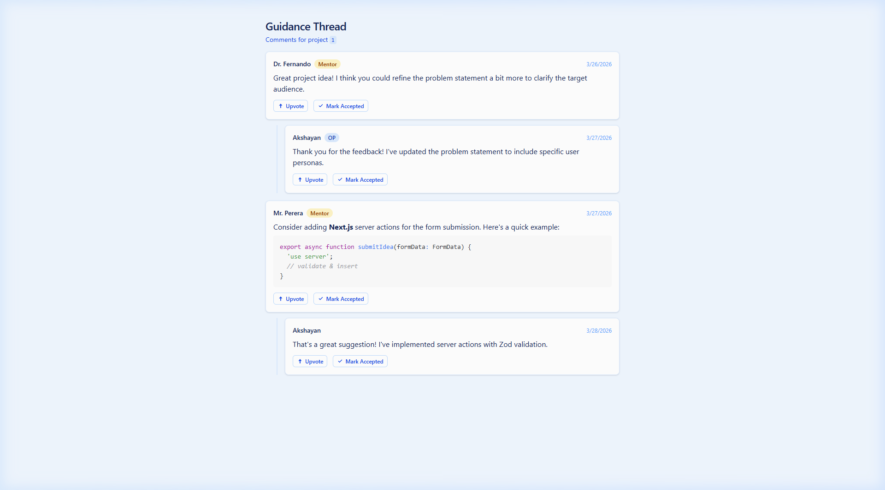
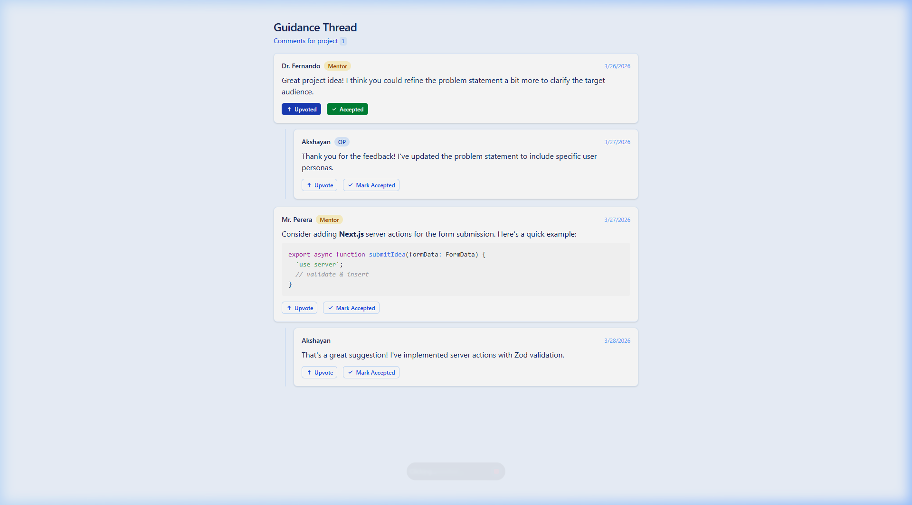

# Progress 1 — UI and Business Rules Document

**Module:** IT3040 – ITPM | Semester 1  
**Programme:** BSc (Hons) in Information Technology — Year 3  
**Date:** March 28, 2026

---

## Student Details

| Field | Value |
|---|---|
| **Student Name** | Akshayan |
| **Registration Number** | *(fill in your SLIIT reg. no.)* |
| **Responsible Component(s)** | Idea & Guidance Module (Member 2) |
| **Description** | A web module that lets students submit project ideas with form validation, receive recursive threaded feedback from mentors and peers with Markdown/code support, and view guidance threads per project with upvote and accept interactions. |

---

## Component Summary

| # | UI Screen | Route | Screenshot |
|---|---|---|---|
| UI 1 | Project Idea Submission Form (Empty) | `/posts/new` | `screenshots/01-post-form-empty.png` |
| UI 2 | Form Validation Errors | `/posts/new` (invalid submit) | `screenshots/02-validation-errors.png` |
| UI 3 | Title Minimum-Length Validation | `/posts/new` (short title) | `screenshots/03-title-min-length-error.png` |
| UI 4 | Form Filled with Valid Data | `/posts/new` (completed) | `screenshots/04-form-filled.png` |
| UI 5 | Successful Submission | `/posts/new` (submitted) | `screenshots/05-form-success.png` |
| UI 6 | Feedback Thread (Comment Tree) | `/feedback` | `screenshots/06-feedback-thread.png` |
| UI 7 | Feedback Upvote & Accept Interactions | `/feedback` (toggled) | `screenshots/07-feedback-upvote-accept.png` |
| UI 8 | Guidance Thread | `/guidance/[projectId]` | `screenshots/08-guidance-thread.png` |
| UI 9 | Guidance Thread Interactions | `/guidance/[projectId]` (toggled) | `screenshots/09-guidance-interactions.png` |

---

## UI 1 & 2: Project Idea Submission Form (`/posts/new`)

**Screenshots:** `01-post-form-empty.png`, `04-form-filled.png`, `05-form-success.png`



### A) Form Fields

| # | Field | Type | Description |
|---|---|---|---|
| F-1 | **Title** | Text input | Descriptive title for the project idea |
| F-2 | **Problem Statement** | Textarea | Multi-line description of the problem |
| F-3 | **Project Variant** | Select dropdown | One of: Research, Prototype, Capstone, Mini-project |
| F-4 | **URLs** | Dynamic URL list | Reference links (add/remove dynamically) |
| F-5 | **Tech Stacks** | Tag Picker (multi-select) | Technology tags: Next.js, React, TypeScript, Tailwind CSS, Supabase, PostgreSQL, Prisma, Node.js |

### B) Validation Rules (Zod Schema)

| # | Field | Rule | Error Message |
|---|---|---|---|
| VR-1 | **Title** | Required. Minimum 10 characters. Trimmed whitespace. | "Title is required" / "Title must be at least 10 characters" |
| VR-2 | **Problem Statement** | Required. Non-empty string. Trimmed. | "Problem statement is required" |
| VR-3 | **Project Variant** | Required. Must be one of the 4 allowed values. | "Please select a project variant" |
| VR-4 | **URLs** | Optional. Each entry must be valid URL format. | "Each URL must be valid (e.g. https://…)" |
| VR-5 | **Tech Stacks** | Optional. Values must be from predefined list. | — |
| VR-6 | **All fields** | Validation uses Zod `safeParse()`. Errors shown inline below each field in red. | — |

### C) Validation Error Screenshots



*Empty form submission triggers: "Title is required", "Problem statement is required", "Please select a project variant"*



*Short title ("test") triggers: "Title must be at least 10 characters"*

### D) Process / Workflow Rules

| # | Rule |
|---|---|
| WF-1 | User fills in form fields → clicks "Submit Idea" → Zod schema validates all fields → if valid, returns success response with submitted data. |
| WF-2 | On successful submission, a green success banner appears showing the submitted data in JSON format. |
| WF-3 | On validation failure, the form re-renders with inline red error messages below each invalid field. Previously entered valid data is preserved. |
| WF-4 | The submit button shows "Submitting…" and is disabled while processing (`useFormStatus` hook), preventing double submissions. |

### E) Successful Submission



*Filled form with title, problem statement, Prototype variant, and 4 selected tech tags*



*Success banner: "Project idea submitted successfully!" with JSON output showing all submitted data*

### F) Tag Picker Interaction Rules

| # | Rule |
|---|---|
| TP-1 | Tags are displayed as pill-shaped buttons in a horizontal row. |
| TP-2 | Clicking a tag toggles it: unselected (white, outlined) → selected (blue filled). |
| TP-3 | A counter shows "N selected" in real-time. |
| TP-4 | Selected tags are serialized as a JSON array in a hidden input field for form submission. |
| TP-5 | Tag state is managed using a `Set<string>` in `useState`. |

### G) URL List Interaction Rules

| # | Rule |
|---|---|
| UL-1 | The form starts with one empty URL input. |
| UL-2 | Click "+ Add another URL" to add additional inputs dynamically. |
| UL-3 | Each input after the first shows a red "×" button to remove that entry. |
| UL-4 | A counter shows "N added" counting only non-empty URLs. |
| UL-5 | Non-empty URLs are serialized as JSON in a hidden input for submission. |

---

## UI 3: Feedback Thread — Comment Tree (`/feedback`)

**Screenshots:** `06-feedback-thread.png`, `07-feedback-upvote-accept.png`



### A) Display Rules

| # | Rule |
|---|---|
| DR-1 | Comments are rendered as a **recursive tree**. Root comments appear at top level; replies are indented with a left blue border line (`border-l-2 border-blue-100 ml-6 pl-4`). |
| DR-2 | Nesting depth is **unlimited** — replies to replies render at increasing indentation. |
| DR-3 | **Mentor** comments display a gold/amber badge ("Mentor") next to the author name. |
| DR-4 | **OP** (Original Poster) comments display a blue badge ("OP") next to the author name. |
| DR-5 | **Student** comments have no special badge — only the author name. |
| DR-6 | Comment body supports full **Markdown**: bold text, links, inline `code`, and fenced code blocks with **syntax highlighting** (Prism / oneLight theme). |
| DR-7 | Code blocks render with proper language-specific coloring (e.g., TSX, TypeScript). |

### B) Interaction Rules — Upvote Toggle

| # | Rule |
|---|---|
| UV-1 | Each comment has an "Upvote" button with an upward arrow icon. |
| UV-2 | Clicking toggles state to "Upvoted" — button fills blue (`bg-blue-800`), text turns white, `aria-pressed="true"`. |
| UV-3 | Clicking again toggles back to default "Upvote" state (`aria-pressed="false"`, outlined styling). |
| UV-4 | Upvote state is **per-comment** and independent of other comments. Client-side only (`useState`). |

### C) Interaction Rules — Accept Solution Toggle (OP Only)

| # | Rule |
|---|---|
| AS-1 | The "Mark Accepted" button appears only when `isOP={true}` (set on the page). |
| AS-2 | Clicking "Mark Accepted" toggles to "Accepted" — button fills green (`bg-green-700`), `aria-pressed="true"`. |
| AS-3 | Clicking again toggles back. Both upvote and accept can be active simultaneously. |
| AS-4 | Upvote and accept are independent toggles — toggling one does not affect the other. |



*First comment showing "Upvoted" (blue) and "Accepted" (green) states active simultaneously*

### D) Tree Building Algorithm

| # | Rule |
|---|---|
| TB-1 | `buildCommentTree()` converts a flat array of comments into a nested tree using a **two-pass O(n) algorithm**. |
| TB-2 | Pass 1: Index each comment in a `Map<id, CommentNode>` with an empty `children` array. |
| TB-3 | Pass 2: Link — if a node has `parent_id` matching another node's `id`, push it into the parent's `children` array. Otherwise, it becomes a root node. |
| TB-4 | Orphan comments (with `parent_id` not found) are promoted to root level. |

---

## UI 4: Guidance Thread (`/guidance/[projectId]`)

**Screenshots:** `08-guidance-thread.png`, `09-guidance-interactions.png`



### A) Display Rules

| # | Rule |
|---|---|
| DR-8 | Page heading reads "Guidance Thread" with the `projectId` displayed in a `<code>` tag in the subtitle. |
| DR-9 | The page uses a **dynamic route** — `/guidance/[projectId]` accepts any project ID as a URL parameter. |
| DR-10 | Comments are displayed with **date stamps** (`created_at`) on the right side of each comment header. |
| DR-11 | The thread structure is identical to the Feedback Thread — recursive nesting, role badges, Markdown/code rendering. |
| DR-12 | **Mentor** comments show amber "Mentor" badge + author name + date. |
| DR-13 | **OP** comments show blue "OP" badge + author name + date. |

### B) Data Fetch Rules

| # | Rule |
|---|---|
| DF-1 | Comments are fetched server-side using `fetchCommentsByProjectId(projectId)` — an async function in the Server Component. |
| DF-2 | If no comments exist for the given `projectId`, an empty state message appears: "No guidance comments yet — be the first to reply!" |
| DF-3 | Comment data is transformed into a nested tree using the same `buildCommentTree()` algorithm used in the Feedback Thread. |

### C) Interactions

| # | Rule |
|---|---|
| GI-1 | Upvote and Mark Accepted buttons function identically to the Feedback Thread. |
| GI-2 | Mentor code suggestions render with syntax highlighting within comment bodies. |



*Mentor comment "Upvoted" (blue) and "Accepted" (green) with code block rendered*

---

## Technology Stack

| Technology | Purpose |
|---|---|
| Next.js 14 (App Router) | React framework with Server/Client Components |
| React 18 | UI component library |
| TypeScript 5 | Type-safe development |
| Tailwind CSS | Utility-first CSS styling |
| Zod | Schema-based form validation |
| react-markdown | Markdown rendering in comments |
| remark-gfm | GitHub-Flavored Markdown support |
| react-syntax-highlighter | Code block syntax highlighting |

---

## Version Control

| Field | Value |
|---|---|
| **Repository** | `https://github.com/sneha-dhaya-IT/Ideabridge.git` |
| **Branch** | `member2-idea-guidance` |
| **Commits** | Meaningful commits tracking each feature addition |

---

## Project Structure

```
src/
├── app/
│   ├── layout.tsx                  ← Root layout (Server Component)
│   ├── page.tsx                    ← Home page
│   ├── globals.css                 ← Global styles
│   ├── posts/new/page.tsx          ← Project Idea Form page
│   ├── feedback/page.tsx           ← Feedback Thread page
│   └── guidance/[projectId]/page.tsx  ← Dynamic Guidance page
├── components/
│   ├── post-form/
│   │   ├── PostForm.tsx            ← Form wrapper + action handler
│   │   ├── PostFormClient.tsx      ← Interactive form UI (useFormState)
│   │   ├── TagPicker.tsx           ← Multi-select tag picker
│   │   └── schema.ts              ← Zod validation schema
│   ├── feedback-thread/
│   │   ├── FeedbackThread.tsx      ← Server Component (tree builder)
│   │   ├── CommentNode.tsx         ← Recursive comment renderer
│   │   ├── CommentNodeClient.tsx   ← Client wrapper
│   │   └── types.ts               ← Types + buildCommentTree()
│   └── guidance-thread/
│       ├── GuidanceThread.tsx      ← Server Component (data fetch + tree)
│       ├── GuidanceCommentNode.tsx ← Recursive comment renderer
│       └── data.ts                ← Types + fetchComments + buildTree
```
